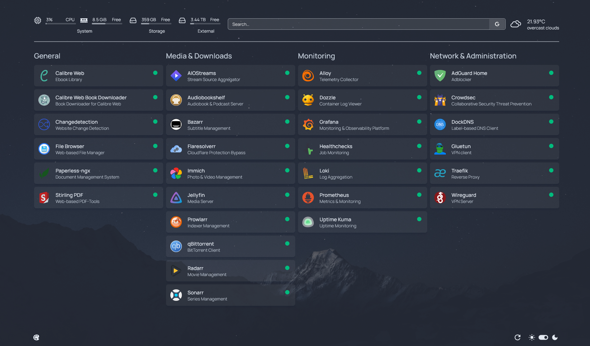

# Nix Podman Stacks

Collection of opinionated Podman stacks managed by [Home Manager](https://github.com/nix-community/home-manager).

The goal is to easily deploy various self-hosted projects, including reverse proxy and monitoring.
This is an opinionated setup that is primarily build with my personal preferences in mind. Nevertheless, all configurations and settings can be overwritten if it doesn't fit your use-case.

While most stacks can be activated by setting a single flag, some stacks require setting mandatory values, especially for secrets.

For managing secrets with nix, i recommend [sops-nix](https://github.com/Mic92/sops-nix) which allows you to store your secrets along with the configuration inside a single Git repository.

## Structure

Most stacks will rely or use some centrally defined variables. These include:

| `tarow.podman` Option    | Description                                                                               |
| ------------------------ | ----------------------------------------------------------------------------------------- |
| `hostIP4Address`         | The IPv4 address of the host. Will be used for example in case of explicit port bindings. |
| `hostUid`                | The UID of the host user running the podman stacks.                                       |
| `storageBaseDir`         | Base storage location used for bind mounts. Used as a base location for bind mounts.      |
| `externalStorageBaseDir` | Base storage location used for media files, e.g. pictures used by Immich.                 |

## Available Stacks

- [Adguard](./modules/adguard/default.nix)
- [AIOStreams](./modules/aiostreams/default.nix)
- [Audiobookshelf](./modules/audiobookshelf/default.nix)
- [Blocky](./modules/blocky/default.nix)
- [Calibre-Web](./modules/calibre/default.nix)
  - Calibre-Web Automated
  - Calibre-Web Automated Book Downloader
- [Changedetection](./modules/changedetection/default.nix)
  - Changedetection
  - Sock Puppet Browser
- [DockDNS](./modules/dockdns/default.nix)
- [Dozzle](./modules/dozzle/default.nix)
- [Filebrowser](./modules/filebrowser/default.nix)
- [Forgejo](./modules/forgejo/default.nix)
- [Healthchecks](./modules/healchecks/default.nix)
- [Homepage](./modules/homepage/default.nix)
- [Immich](./modules/immich/default.nix)
- [Mealie](./modules/mealie/default.nix)
- [Monitoring](./modules/monitoring/default.nix)
  - Alloy
  - Grafana
  - Loki
  - Prometheus
  - Podman Metrics Exporter
- [Paperless-ngx](./modules/paperless/default.nix)
  - Paperless-ngx
  - FTP Server
- [Stirling-PDF](./modules/stirling-pdf/default.nix)
- [Streaming](./modules/streaming/default.nix)
  - Bazarr
  - Flaresolverr
  - Jellyfin
  - Prowlarr
  - qBittorrent
  - Radarr
  - Sonarr
- [Traefik](./modules/traefik/default.nix)
- [Uptime-Kuma](./modules/uptime-kuma/default.nix)
- [wg-easy](./modules/wg-easy/default.nix)

## Prerequisites

- [Nix Installation](https://nixos.org/download/#nix-install-linux)
- `net.ipv4.ip_unprivileged_port_start=0` or any other way of allowing non-root processes to bind to ports below 1024

## Setup

If you already have an existing flake setup, add this projects flake as an input and include the flake output `homeModules.all` in your Home Manager modules.

---

If you don't use Nix yet, you can use the projects template to get started:

1. `nix flake init --template github:Tarow/nix-podman-stacks`
2. Modify the `stacks.nix` file to enable, disable and modify settings to your preferences
3. Generate your age key and create the `.sops.yaml` based on the `.sops.yaml.example`
4. Create the `secrets.yaml` file containing all secrets used in the stack configurations
5. Make sure to declare the used secrets in the `stacks.nix` file
6. Modify the `flake.nix` to reflect your system architecture, username and home directory
7. Apply your configuration: `nix run home-manager -- switch --experimental-features "nix-command flakes pipe-operators" -b bak --flake .#myhost`

This is just one example. Feel free to use a different tool for secret management or restructure files to your preference.

## Customize Settings

The Podman stacks are mostly opinionated and configured to work out of the box.
Refer to each module to see which options are exposed on stack level and can be modified.
An example would be [Traefik](./modules/traefik/default.nix), which requires a domain to be set.
Also it ships with preconfigured static and dynamic configurations, but allows you to extend or customize those.

If the exposed options are not enough for you, you can always refer to the container definition directly, by using the `tarow.podman.stacks.<stackname>.containers.<containername>` options.

Refer to the [examples](./examples) to see various use cases of setting and overriding options.
